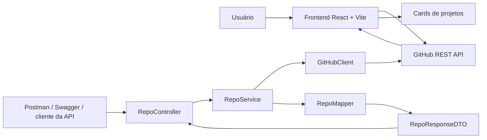
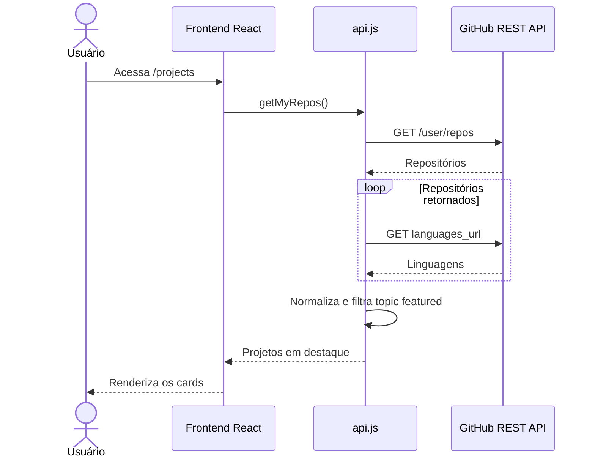
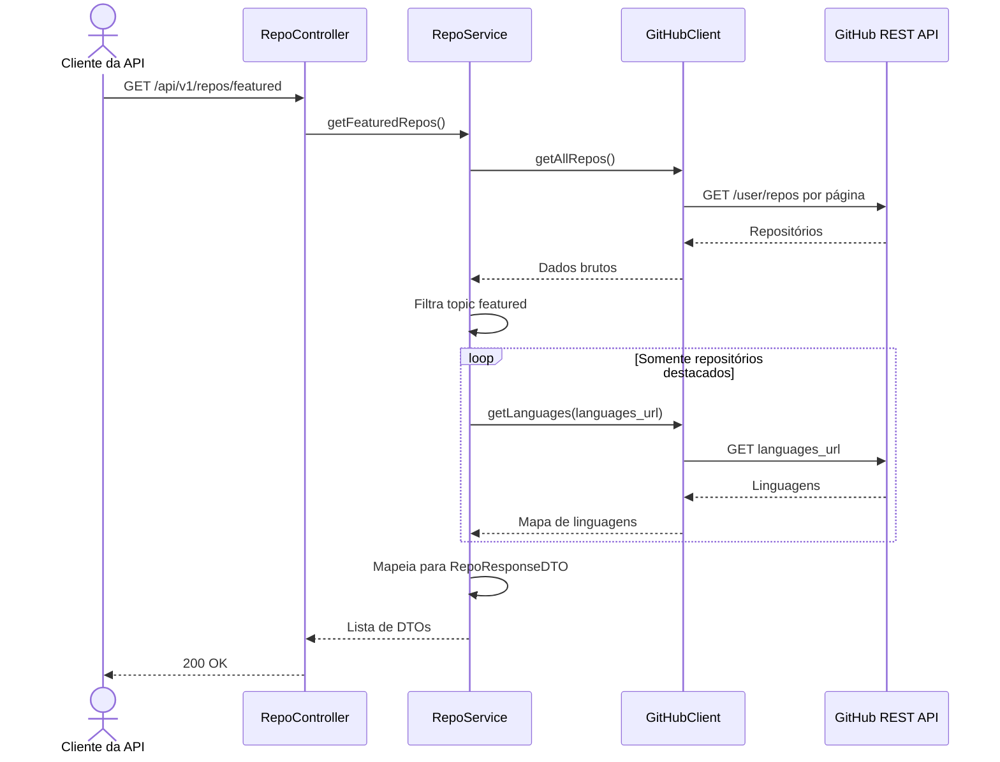

# Portfolio 2.0

Monorepo do portfólio web de Lucas Garcia. O projeto reúne duas aplicações independentes que consultam a GitHub REST API:

- um frontend React/Vite publicado como site;
- um backend Spring Boot criado para praticar e demonstrar integração, separação em camadas, segurança, documentação OpenAPI e testes.

O frontend não depende do backend para funcionar. Essa é uma decisão arquitetural do projeto: o site continua consultando o GitHub diretamente para manter o deploy simples e evitar que a disponibilidade de um backend próprio se torne requisito para exibir os projetos.

## Módulos

| Módulo | Estado atual | README |
| --- | --- | --- |
| `frontend` | Funcional, integrado diretamente ao GitHub e preparado para Vercel | [Documentação do frontend](frontend/README.md) |
| `backend` | Primeira versão funcional da API Spring Boot | [Documentação do backend](backend/README.md) |

## Funcionalidades

### Frontend

- Home com apresentação, sobre, stacks e serviços.
- Página de projetos com repositórios marcados com o topic `featured`.
- Página de contato.
- Componentes visuais React Bits/WebGL.
- Layout responsivo e deploy SPA na Vercel.

### Backend

- Integração autenticada com a GitHub REST API usando `RestClient`.
- Paginação dos repositórios do usuário.
- Filtro local pelo topic `featured` antes das chamadas de linguagens.
- Mapeamento dos dados externos para `RepoResponseDTO`.
- Endpoint público `GET /api/v1/repos/featured`.
- Swagger/OpenAPI.
- Spring Security com liberação explícita da API e da documentação.
- Resposta padronizada para falhas da integração com GitHub.
- Testes unitários e testes reais mantidos como validação manual.

## Decisão arquitetural

As duas aplicações compartilham o GitHub como fonte de dados, mas não possuem dependência de execução entre si.



Essa separação atende a dois objetivos:

- o frontend continua publicável sem contratar ou manter infraestrutura para o backend;
- o backend evolui como projeto técnico próprio, sem colocar a disponibilidade do portfólio em risco.

## Sequência do frontend



## Sequência do backend



## Segurança da integração direta

O frontend atualmente lê `VITE_GITHUB_TOKEN`. Variáveis `VITE_*` são incorporadas ao bundle e podem ser vistas por quem acessa o site; portanto, esse token não deve ser tratado como segredo.

Para manter o frontend independente com menor risco, uma evolução possível é consultar somente repositórios públicos por um endpoint público do GitHub, sem token. Enquanto o token for usado no navegador, ele deve possuir o menor conjunto possível de permissões e nunca dar acesso de escrita.

No backend, `GITHUB_TOKEN` é uma variável do processo e não é devolvida ao consumidor da API.

## Stack

### Frontend

- React 19
- Vite
- React Router
- Axios
- Tailwind CSS
- Three.js, React Three Fiber, Drei e OGL

### Backend

- Java 21
- Spring Boot 4.1
- Spring Web MVC e RestClient
- Spring Security
- Springdoc OpenAPI
- JUnit e Mockito
- Maven Wrapper
- JPA, H2 e PostgreSQL preparados para uma fase futura de persistência

## Como executar

### Frontend

```bash
cd frontend
npm install
npm run dev
```

Crie `frontend/.env` quando a chamada autenticada ao GitHub for necessária:

```env
VITE_GITHUB_TOKEN=seu_token
```

### Backend

No Windows PowerShell:

```powershell
cd backend
$env:GITHUB_TOKEN="seu_token"
.\mvnw.cmd spring-boot:run
```

Endpoint:

```text
GET http://localhost:8080/api/v1/repos/featured
```

Swagger UI:

```text
http://localhost:8080/swagger-ui.html
```

## Validação

```bash
cd frontend
npm run lint
npm run build
```

```powershell
cd backend
.\mvnw.cmd test
```

Os testes que chamam a API real do GitHub são manuais e ficam desabilitados na suíte padrão para não depender de rede ou token válido.

## Próximas evoluções

- Adicionar teste HTTP para o contrato do `GlobalExceptionHandler`.
- Configurar timeout e logs estruturados no `GitHubClient`.
- Avaliar cache no backend para reduzir chamadas externas.
- Avaliar acesso público sem token no frontend.
- Evoluir o backend com PostgreSQL e sincronização, sem tornar essa API obrigatória para o frontend.

## Autor

Lucas Garcia  
Software Engineering Student  
Backend | Frontend | Data Systems | AI Applications
