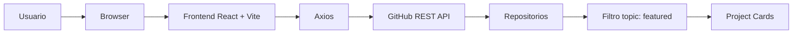
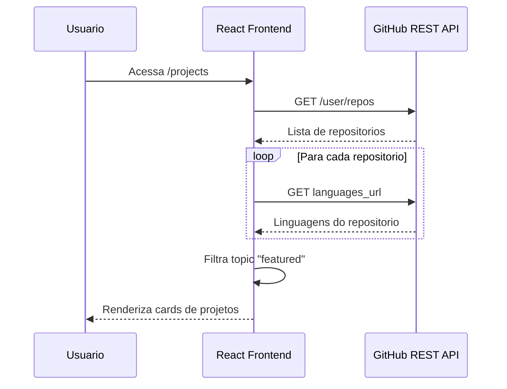
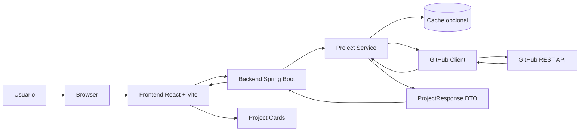
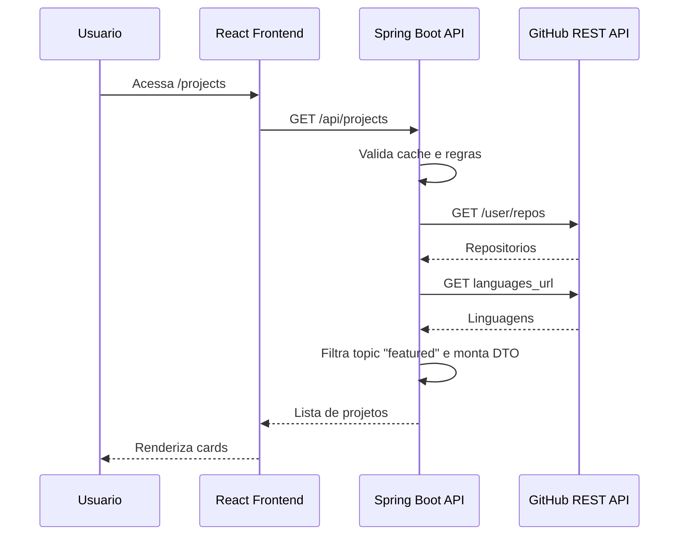
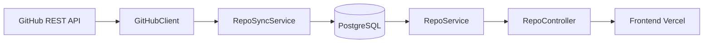

# Portfolio 2.0

Monorepo do portfolio web de Lucas Garcia. O projeto combina um frontend moderno em React/Vite com um backend Spring Boot em construcao, planejado para centralizar a comunicacao com a GitHub API.

## Modulos

```text
portfolio-2.0/
├── frontend/   # React + Vite, UI do portfolio e integracao atual com GitHub API
└── backend/    # Spring Boot, futuro gateway da GitHub API
```

| Modulo | Status | README |
| --- | --- | --- |
| `frontend` | Implementado e integrado diretamente com GitHub API | [`frontend/README.md`](frontend/README.md) |
| `backend` | Scaffold Spring Boot criado, API ainda em desenvolvimento | [`backend/README.md`](backend/README.md) |

## Visao Geral

O portfolio apresenta:

- Home com apresentacao, sobre mim, stacks e servicos.
- Pagina de projetos com repositorios carregados dinamicamente.
- Pagina de contato.
- Efeitos visuais com componentes React Bits/WebGL.
- Deploy frontend preparado para Vercel.
- Backend Spring Boot planejado para proteger credenciais e organizar a integracao com GitHub.

## Arquitetura Atual

Hoje o frontend acessa a GitHub API diretamente pelo browser.



Fluxo atual:



### Limite da Arquitetura Atual

O token atual e lido como `VITE_GITHUB_TOKEN`. Variaveis `VITE_*` entram no bundle do frontend, entao essa abordagem e temporaria e deve ser substituida pelo backend.

## Arquitetura Alvo

Na arquitetura final, o frontend chamara apenas a API propria. O backend Spring Boot sera responsavel por chamar o GitHub, proteger o token, normalizar dados e aplicar regras de cache/filtro.



Responsabilidades principais:

- `GitHubClient`: integra com a GitHub API, monta headers, token, query params e paginacao, retornando os dados brutos do GitHub.
- `ProjectService`: decide o que fazer com esses dados, aplicando filtros, ordenacao, regras da aplicacao e transformacao para DTOs.
- `ProjectController`: expoe os dados tratados para o frontend por meio da API REST propria.

Resumo da separacao:

```text
Client busca. Service decide. Controller expoe.
```

Fluxo planejado:



## Contrato Planejado

```http
GET /api/projects
```

Resposta esperada:

```json
[
  {
    "id": 123,
    "name": "project-name",
    "description": "Project description",
    "url": "https://github.com/user/project-name",
    "homepage": "https://project-demo.vercel.app",
    "languages": {
      "JavaScript": 12000,
      "CSS": 3000
    },
    "topics": ["featured"]
  }
]
```

## Stack

### Frontend

- React 19
- Vite
- React Router
- Axios
- CSS
- Three.js, React Three Fiber, Drei e OGL

### Backend

- Java 21
- Spring Boot
- Spring Web MVC
- Spring Security
- Spring Data JPA
- RestClient
- H2 e PostgreSQL
- Lombok

## Como Rodar

Frontend:

```bash
cd frontend
npm install
npm run dev
```

Backend:

```bash
cd backend
export GITHUB_TOKEN="seu_token_do_github"
./mvnw spring-boot:run
```

No Windows PowerShell:

```powershell
cd backend
$env:GITHUB_TOKEN="seu_token_do_github"
.\mvnw.cmd spring-boot:run
```

O token do GitHub fica fora do Git. O backend le `GITHUB_TOKEN` por variavel de ambiente e faz o bind para `GitHubProperties`, usado pelo `GitHubClient`.

## Roadmap Fullstack

- Implementar `GET /api/projects` no backend.
- Mover `GITHUB_TOKEN` para variavel de ambiente server-side.
- Trocar o frontend para consumir o backend.
- Adicionar cache para reduzir chamadas ao GitHub.
- Padronizar respostas e tratamento de erros.
- Preparar deploy fullstack.

## Fase 3 - Persistencia e Sincronizacao

Depois que o backend estiver expondo a API de projetos/repositorios, a proxima evolucao planejada e persistir os projetos destacados em PostgreSQL. A ideia e transformar a integracao com GitHub em um processo de sincronizacao, mantendo o frontend consumindo apenas a API propria.

Arquitetura planejada para essa fase:



Objetivo da fase:

- Buscar repositorios no GitHub.
- Filtrar projetos com topic `featured`.
- Salvar ou atualizar os projetos no PostgreSQL.
- Expor a API propria lendo do banco, nao diretamente do GitHub.
- Evitar duplicacao usando o `id` do GitHub como referencia externa.
- Permitir que o frontend continue desacoplado, consumindo somente o backend.

Estrategia inicial:

- Rodar a sincronizacao quando o backend subir.
- Se a API do GitHub falhar, registrar o erro e manter o backend funcionando.
- Depois evoluir para sincronizacao agendada com `@Scheduled`.
- Futuramente adicionar endpoint manual como `POST /api/repos/sync`.

## Autor

Lucas Garcia  
Software Engineering Student  
Backend | Frontend | Data Systems | AI Applications
