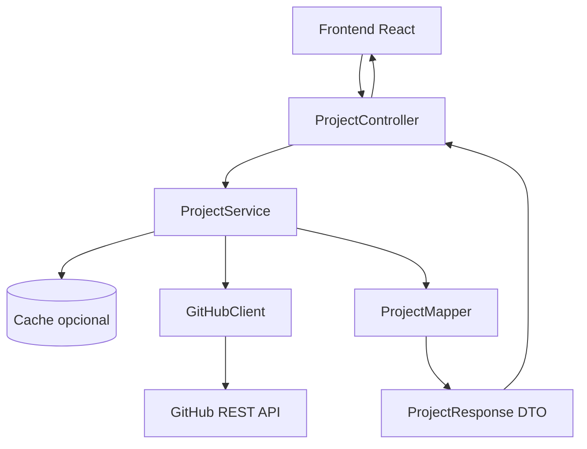
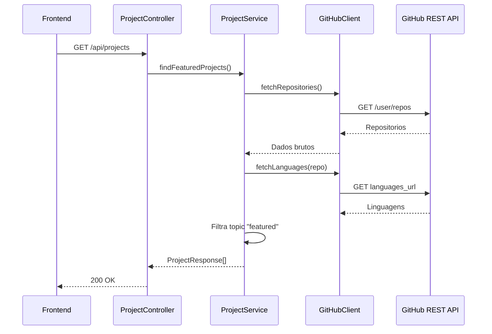

# Portfolio 2.0 - Backend

Backend Spring Boot do portfolio. Este modulo sera responsavel por intermediar a comunicacao entre o frontend e a GitHub API, protegendo credenciais e centralizando regras de negocio.

## Estado Atual

O backend ainda esta em fase inicial.

Ja existe:

- Projeto Spring Boot criado.
- Classe principal `BackendApplication`.
- Teste de contexto `BackendApplicationTests`.
- Configuracao basica em `application.properties`.
- Dependencias para Web MVC, Security, RestClient, JPA, H2, PostgreSQL e Lombok.

Ainda nao existe:

- Controller REST.
- Service de projetos.
- Client da GitHub API.
- DTOs de resposta.
- Configuracao de CORS.
- Variaveis de ambiente para GitHub.
- Cache.

## Stack

- Java 21
- Spring Boot 4.1.0
- Spring Web MVC
- Spring Security
- Spring Data JPA
- Spring RestClient
- H2
- PostgreSQL
- Lombok
- Maven Wrapper

## Arquitetura Planejada



## Fluxo Planejado



## Estrutura Atual

```text
backend/
├── mvnw
├── mvnw.cmd
├── pom.xml
└── src/
    ├── main/
    │   ├── java/
    │   │   └── br/com/garcia/backend/portfolio/
    │   │       └── BackendApplication.java
    │   └── resources/
    │       └── application.properties
    └── test/
        └── java/
            └── br/com/garcia/backend/portfolio/
                └── BackendApplicationTests.java
```

## Estrutura Planejada

```text
src/main/java/br/com/garcia/backend/portfolio/
├── BackendApplication.java
├── config/
│   ├── CorsConfig.java
│   └── SecurityConfig.java
├── controller/
│   └── ProjectController.java
├── dto/
│   └── ProjectResponse.java
├── client/
│   └── GitHubClient.java
├── service/
│   └── ProjectService.java
└── mapper/
    └── ProjectMapper.java
```

## Contrato Planejado

```http
GET /api/projects
```

Resposta:

```json
[
  {
    "id": 123,
    "name": "project-name",
    "description": "Project description",
    "url": "https://github.com/user/project-name",
    "homepage": "https://project-demo.vercel.app",
    "languages": {
      "JavaScript": 12000,
      "CSS": 3000
    },
    "topics": ["featured"]
  }
]
```

## Variaveis de Ambiente Planejadas

```env
GITHUB_TOKEN=seu_token_do_github
GITHUB_USERNAME=lucasz-g
FRONTEND_ORIGIN=http://localhost:5173
```

## Como Rodar

No Windows PowerShell:

```powershell
.\mvnw.cmd spring-boot:run
```

Em Linux/macOS:

```bash
./mvnw spring-boot:run
```

## Testes

No Windows PowerShell:

```powershell
.\mvnw.cmd test
```

Em Linux/macOS:

```bash
./mvnw test
```

## Proximos Passos

1. Criar `ProjectController`.
2. Criar `GitHubClient` com `RestClient`.
3. Criar `ProjectService` para filtro por topic `featured`.
4. Criar DTOs para resposta ao frontend.
5. Configurar CORS para o frontend.
6. Mover token do GitHub para variavel server-side.
7. Adicionar cache para reduzir chamadas externas.
8. Atualizar o frontend para consumir `GET /api/projects`.
