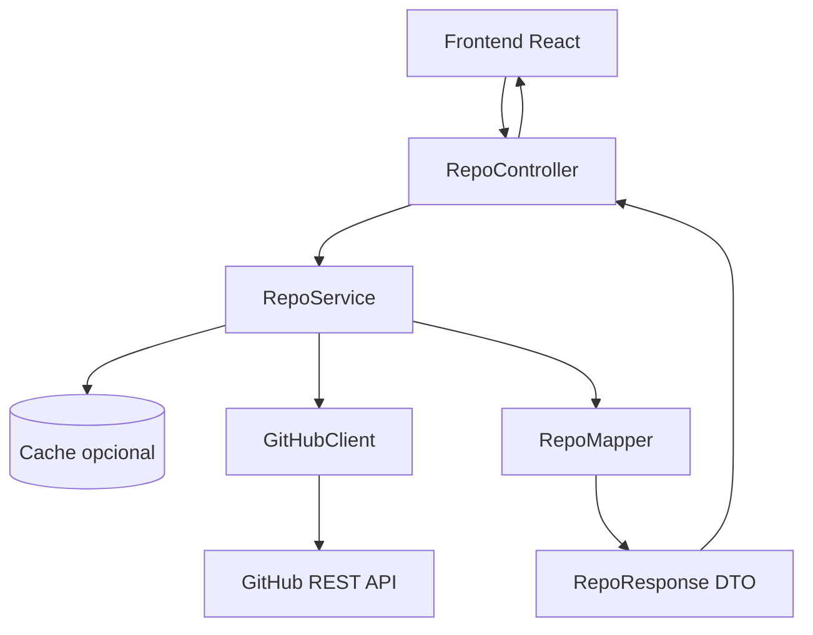
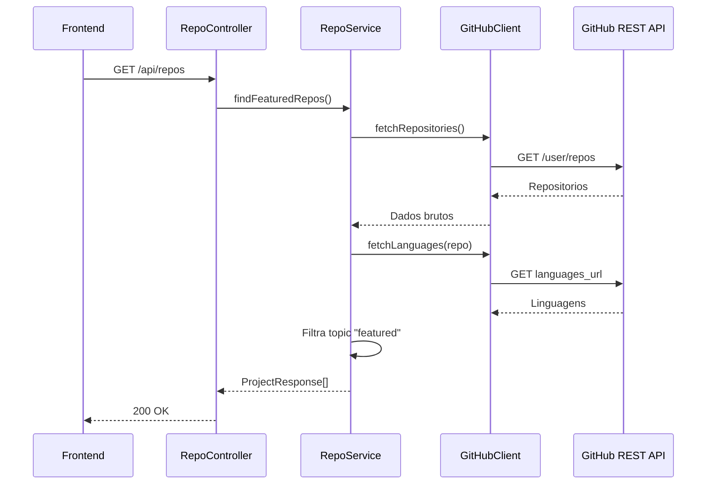
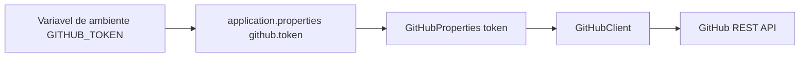
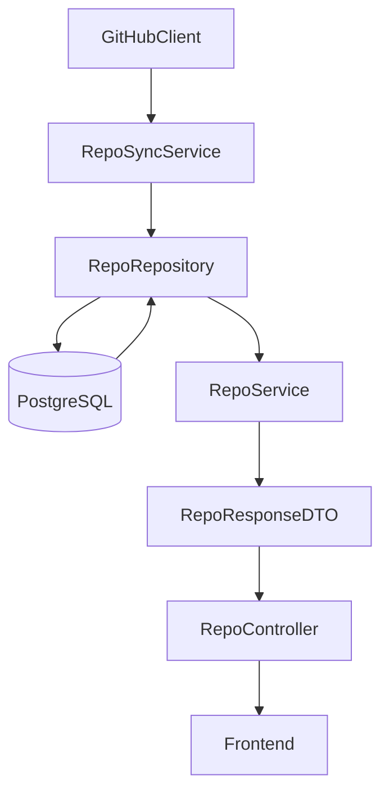

# Portfolio 2.0 - Backend

Backend Spring Boot do portfolio. Este modulo sera responsavel por intermediar a comunicacao entre o frontend e a GitHub API, protegendo credenciais e centralizando regras de negocio.

## Estado Atual

O backend ainda esta em fase inicial.

Ja existe:

- Projeto Spring Boot criado.
- Classe principal `BackendApplication`.
- Teste de contexto `BackendApplicationTests`.
- Configuracao basica em `application.properties`.
- `GitHubClient` com `RestClient` para consumir a GitHub API.
- `GitHubProperties` com `@ConfigurationProperties` para centralizar as propriedades da integracao com GitHub.
- Placeholder `github.token=${GITHUB_TOKEN}` para ler o token via variavel de ambiente.
- `.env.example` com exemplo de configuracao local sem expor segredo real.
- Dependencias para Web MVC, Security, RestClient, JPA, H2, PostgreSQL e Lombok.

Ainda nao existe:

- Controller REST.
- Service de projetos.
- DTOs de resposta.
- Configuracao de CORS.
- Cache.

## Stack

- Java 21
- Spring Boot 4.1.0
- Spring Web MVC
- Spring Security
- Spring Data JPA
- Spring RestClient
- H2
- PostgreSQL
- Lombok
- Maven Wrapper

## Arquitetura Planejada



## Responsabilidades das Camadas

Separacao principal da integracao com GitHub:

```text
GitHubClient
- Fala com a GitHub API.
- Monta base URL, headers, token, query params e paginacao.
- Retorna os dados brutos vindos do GitHub.

RepoService
- Usa o GitHubClient.
- Aplica regras da aplicacao.
- Filtra, ordena e transforma os dados.
- Entrega uma resposta limpa para Controller/Frontend.

RepoController
- Expoe os endpoints REST do backend.
- Recebe a chamada do frontend.
- Retorna os DTOs produzidos pela camada de service.
```

Frase guia da arquitetura:

```text
Client busca. Service decide. Controller expoe.
```

## Fluxo Planejado



## Estrutura Atual

```text
backend/
├── mvnw
├── mvnw.cmd
├── pom.xml
└── src/
    ├── main/
    │   ├── java/
    │   │   └── br/com/garcia/backend/portfolio/
    │   │       ├── BackendApplication.java
    │   │       ├── client/
    │   │       │   └── GitHubClient.java
    │   │       └── config/
    │   │           └── GitHubProperties.java
    │   └── resources/
    │       └── application.properties
    └── test/
        ├── resources/
        │   └── application.properties
        └── java/
            └── br/com/garcia/backend/portfolio/
                └── BackendApplicationTests.java
```

## Estrutura Planejada

```text
src/main/java/br/com/garcia/backend/portfolio/
├── BackendApplication.java
├── config/
│   ├── CorsConfig.java
│   └── SecurityConfig.java
├── controller/
│   └── RepoController.java
├── dto/
│   └── RepoResponse.java
├── client/
│   └── GitHubClient.java
├── service/
│   └── RepoService.java
└── mapper/
    └── RepoMapper.java
```

## Contrato Planejado

```http
GET /api/repo
```

Resposta:

```json
[
  {
    "id": 123,
    "name": "project-name",
    "description": "Project description",
    "url": "https://github.com/user/project-name",
    "homepage": "https://project-demo.vercel.app",
    "languages": {
      "JavaScript": 12000,
      "CSS": 3000
    },
    "topics": ["featured"]
  }
]
```

## Variaveis de Ambiente Planejadas

```env
GITHUB_TOKEN=seu_token_do_github
GITHUB_USERNAME=lucasz-g
FRONTEND_ORIGIN=http://localhost:5173
```

## Configuracao do Token do GitHub

O token do GitHub nao deve ser escrito diretamente em `application.properties`, porque esse arquivo e versionado no Git. O backend usa variavel de ambiente para manter o segredo fora do repositorio.

Configuracao atual:

```properties
spring.application.name=backend
github.token=${GITHUB_TOKEN}
```

Fluxo da configuracao:



`GitHubProperties` faz o bind das propriedades com prefixo `github`:

```java
@ConfigurationProperties(prefix = "github")
public record GitHubProperties(String token) {
}
```

Esse bind nao le o arquivo `.env` diretamente. Ele le propriedades que o Spring ja conhece. No caso atual, o Spring resolve `github.token` a partir da variavel de ambiente `GITHUB_TOKEN`.

O `GitHubClient` recebe `GitHubProperties` no construtor:

```java
public GitHubClient(RestClient.Builder restClientBuilder, GitHubProperties gitHubProperties) {
    this.restClient = restClientBuilder
            .baseUrl("https://api.github.com")
            .defaultHeaders(headers -> {
                headers.setBearerAuth(gitHubProperties.token());
                headers.set("Accept", "application/vnd.github.v3+json");
            })
            .build();
}
```

### Por que usar bind em vez de `@Value`

Para apenas um valor, `@Value("${github.token}")` funcionaria. O bind com `@ConfigurationProperties` foi escolhido porque a integracao com GitHub tende a crescer.

Exemplo de configuracoes futuras:

```properties
github.token=${GITHUB_TOKEN}
github.base-url=https://api.github.com
github.username=lucasz-g
github.per-page=100
github.featured-topic=featured
```

Com `@ConfigurationProperties`, essas configuracoes ficam agrupadas em uma classe tipada, evitando espalhar `@Value` por varias classes.

### Uso local

No PowerShell:

```powershell
$env:GITHUB_TOKEN="seu_token_do_github"
.\mvnw.cmd spring-boot:run
```

Em Linux/macOS:

```bash
export GITHUB_TOKEN="seu_token_do_github"
./mvnw spring-boot:run
```

O arquivo `.env.example` existe apenas como modelo:

```env
GITHUB_TOKEN=your_github_token_here
```

Se voce criar um `.env` local, ele nao deve ser commitado. O `.gitignore` ja ignora `.env` e arquivos locais similares.

Para testes, existe `src/test/resources/application.properties` com um token fake:

```properties
github.token=test-token
```

Isso permite subir o contexto do Spring nos testes sem depender de um token real.

## Como Rodar

No Windows PowerShell:

```powershell
$env:GITHUB_TOKEN="seu_token_do_github"
.\mvnw.cmd spring-boot:run
```

Em Linux/macOS:

```bash
export GITHUB_TOKEN="seu_token_do_github"
./mvnw spring-boot:run
```

## Testes

No Windows PowerShell:

```powershell
.\mvnw.cmd test
```

Em Linux/macOS:

```bash
./mvnw test
```

## Proximos Passos

1. Criar `RepoController`.
2. Criar `RepoService` para filtro por topic `featured`.
3. Criar DTOs para resposta ao frontend.
4. Configurar CORS para o frontend.
5. Adicionar cache para reduzir chamadas externas.
6. Atualizar o frontend para consumir `GET /api/repos`.

## Fase 3 - PostgreSQL como Fonte de Leitura

Apos a primeira versao do backend consumir a GitHub API e expor `GET /api/repos`, a proxima fase planejada e persistir os projetos destacados em PostgreSQL.

O frontend nao deve consumir o banco diretamente. Mesmo com PostgreSQL, o fluxo continua passando pelo backend:

```text
GitHub API -> Backend Spring -> PostgreSQL -> Backend Spring API -> Frontend
```

Arquitetura alvo dessa fase:



### Objetivo

- Buscar repositorios no GitHub.
- Filtrar apenas projetos com topic `featured`.
- Salvar ou atualizar esses projetos no PostgreSQL.
- Fazer `GET /api/repos` ler do banco.
- Reduzir dependencia de chamadas ao GitHub durante o uso normal do frontend.
- Praticar uma stack backend mais completa com Spring, JPA e PostgreSQL.

### Novas Camadas Necessarias

```text
entity/
  RepoEntity.java

repository/
  RepoRepository.java

service/
  RepoSyncService.java
  RepoService.java
```

Papel de cada camada:

- `RepoEntity`: representa a tabela de repositorios/projetos no PostgreSQL.
- `RepoRepository`: faz acesso ao banco com Spring Data JPA.
- `RepoSyncService`: busca dados no GitHub, filtra `featured` e grava no banco.
- `RepoService`: busca projetos persistidos e monta DTOs para o controller.

### Estrategia de Sincronizacao

Primeira versao:

- Rodar a sincronizacao quando o backend iniciar.
- Usar o `id` do GitHub como identificador externo para evitar duplicidade.
- Se a API do GitHub falhar, logar o erro e manter o backend no ar.

Evolucao futura:

- Rodar sincronizacao agendada com `@Scheduled`.
- Criar endpoint manual `POST /api/repos/sync`.
- Salvar `lastSyncedAt` para acompanhar quando o projeto foi atualizado.
- Adicionar tratamento de erro e logs mais claros para falhas da GitHub API.
