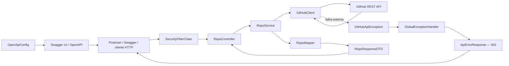
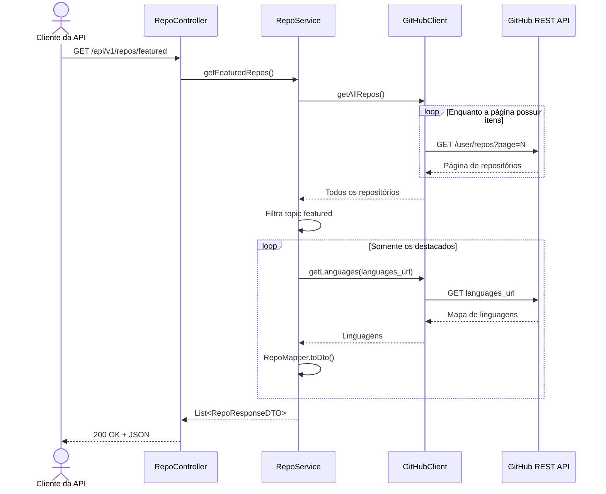
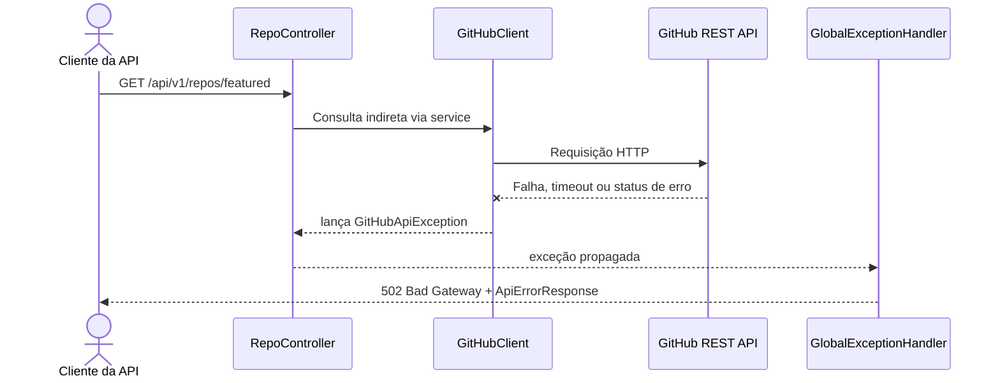

# Portfolio 2.0 — Backend

API Spring Boot que consulta a GitHub REST API, seleciona repositórios destacados e expõe uma resposta própria e estável.

Este backend é funcional, mas não é uma dependência do frontend publicado. Ele existe como módulo independente para demonstrar integração entre sistemas e conceitos de backend aplicados ao projeto real.

## Estado atual

- Endpoint `GET /api/v1/repos/featured` implementado.
- Integração com GitHub usando `RestClient` e token no ambiente do backend.
- Paginação de repositórios.
- Filtro pelo topic `featured` antes da consulta de linguagens.
- DTO e mapper para controlar o contrato de saída.
- Spring Security com rotas públicas explícitas.
- Swagger UI e descrição OpenAPI com metadados centralizados em `OpenApiConfig`.
- Exceção própria para falhas do GitHub.
- Resposta de erro padronizada pelo `GlobalExceptionHandler`.
- Teste unitário do fluxo de service.
- Testes reais de integração disponíveis como validação manual e desabilitados por padrão.

Em uma medição manual durante o desenvolvimento, filtrar os repositórios antes de consultar `languages_url` reduziu o tempo observado de aproximadamente 18 segundos para 4,79 segundos. Esse número depende da rede, da quantidade de repositórios e do tempo de resposta do GitHub.

## Arquitetura



Responsabilidades:

```text
GitHubClient busca.
RepoService decide.
RepoMapper transforma.
RepoController expõe.
GlobalExceptionHandler padroniza falhas.
```

### Por que filtrar antes de buscar linguagens?

O JSON do repositório contém `languages_url`, não o mapa completo de linguagens. A chamada adicional continua necessária, mas é feita somente para os repositórios que possuem o topic `featured`.

```text
P páginas de repositórios + N repositórios destacados
= P + N chamadas HTTP
```

Antes da otimização, o backend consultava linguagens de todos os repositórios e descartava a maior parte depois.

## Fluxo de sucesso



## Fluxo de erro



## Contrato da API

### Repositórios destacados

```http
GET /api/v1/repos/featured
```

Resposta `200 OK`:

```json
[
  {
    "repoId": 1230127938,
    "repoName": "checkin-api",
    "repoDescription": "API de check-in",
    "repoUrl": "https://github.com/lucasz-g/checkin-api",
    "repoHomePage": "",
    "languages": {
      "Java": 91964
    },
    "repoTopics": [
      "featured"
    ]
  }
]
```

### Falha na integração

Resposta `502 Bad Gateway`:

```json
{
  "timestamp": "2026-07-13T18:00:00Z",
  "status": 502,
  "error": "Bad Gateway",
  "message": "Erro ao buscar repositórios",
  "path": "/api/v1/repos/featured"
}
```

O handler não devolve a causa técnica nem o token ao cliente. A causa original permanece encadeada na exceção para diagnóstico interno.

## Estrutura

```text
src/main/java/br/com/garcia/backend/portfolio/
├── BackendApplication.java
├── client/
│   └── GitHubClient.java
├── config/
│   ├── GitHubProperties.java
│   ├── OpenApiConfig.java
│   └── SecurityConfig.java
├── controller/
│   └── RepoController.java
├── dtos/
│   └── RepoResponseDTO.java
├── exceptions/
│   ├── ApiErrorResponse.java
│   ├── GitHubApiException.java
│   └── GlobalExceptionHandler.java
├── mapper/
│   └── RepoMapper.java
└── service/
    └── RepoService.java
```

## Configuração

O Spring resolve o token por meio de:

```properties
github.token=${GITHUB_TOKEN}
```

O `GitHubProperties` faz o bind tipado e entrega o valor ao `GitHubClient`. O arquivo `.env` não é lido automaticamente pelo Spring; a forma direta de execução é definir a variável no processo.

No Windows PowerShell:

```powershell
$env:GITHUB_TOKEN="seu_token_do_github"
.\mvnw.cmd spring-boot:run
```

Em Linux/macOS:

```bash
export GITHUB_TOKEN="seu_token_do_github"
./mvnw spring-boot:run
```

O `.env` local está ignorado pelo Git e `.env.example` documenta somente o nome esperado da variável.

## Segurança e documentação

O `OpenApiConfig` centraliza as informações gerais apresentadas no Swagger:

| Campo | Valor |
| --- | --- |
| Título | `Portfolio GitHub API` |
| Versão | `1.0` |
| Descrição | API intermediária para consulta e processamento dos projetos em destaque do GitHub |

O controller complementa essa definição geral com `@Operation`, descrevendo individualmente o endpoint de repositórios destacados.

Estas rotas são públicas:

```text
/api/v1/repos/**
/swagger-ui.html
/swagger-ui/**
/v3/api-docs/**
```

Swagger UI:

```text
http://localhost:8080/swagger-ui.html
```

Descrição OpenAPI:

```text
http://localhost:8080/v3/api-docs
```

## Testes

```powershell
.\mvnw.cmd test
```

A suíte padrão cobre o carregamento do contexto e a regra do `RepoService` com `GitHubClient` mockado. Ela também verifica que repositórios sem `featured` não provocam chamada desnecessária a `getLanguages()`.

Os testes anotados com `@Disabled` chamam a API real e devem ser executados manualmente com rede e token válido.

## Relação com o frontend

O frontend não consome este endpoint atualmente. Ambos os módulos consultam o GitHub de forma independente:

```text
Frontend React ──> GitHub API
Backend Spring ──> GitHub API
```

Isso evita que uma indisponibilidade ou ausência de deploy do backend impeça o portfólio de carregar. A API permanece disponível para demonstração local, testes via Postman/Swagger e futuras integrações.

## Próximos passos

### Necessário para robustez

- Adicionar teste HTTP do `GlobalExceptionHandler` e do contrato `502`.
- Configurar timeouts de conexão e leitura no cliente HTTP.
- Substituir comentários de depuração por logs estruturados.

### Evolução opcional

- Adicionar cache para reduzir chamadas ao GitHub.
- Persistir snapshots em PostgreSQL com JPA.
- Criar sincronização manual ou agendada.
- Publicar o backend quando houver uma plataforma adequada, sem tornar o frontend dependente dele.
