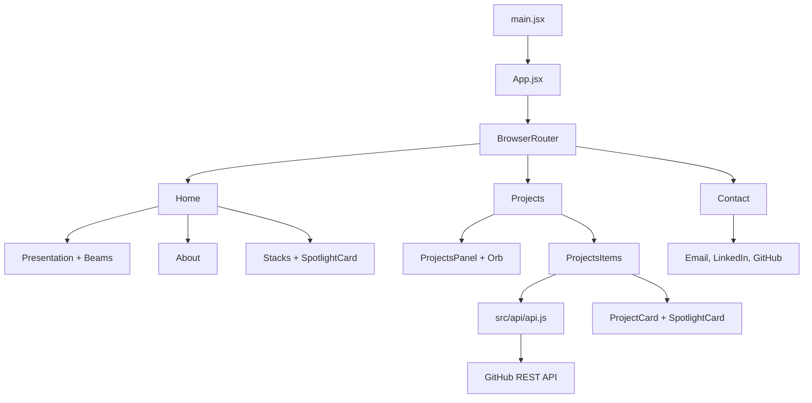
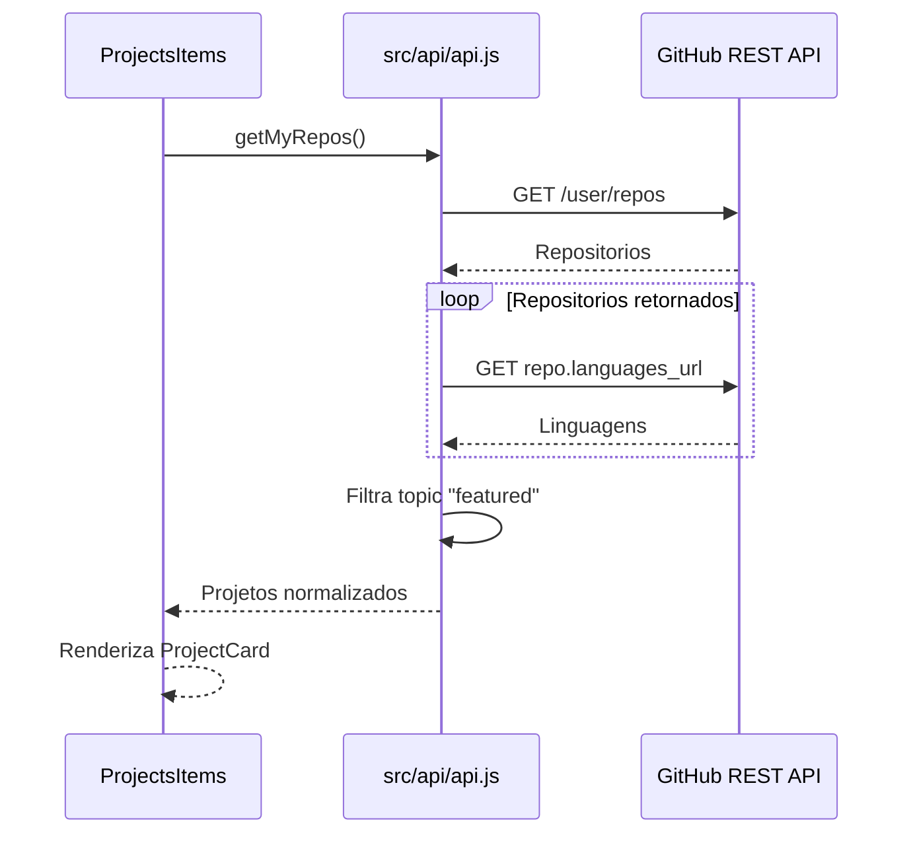

# Portfolio 2.0 - Frontend

Frontend do portfolio, desenvolvido com React e Vite. Esta aplicacao entrega a experiencia visual do site, as rotas publicas e a integracao atual com a GitHub REST API para carregar projetos em destaque.

## Estado Atual

- Frontend implementado.
- Integracao direta com GitHub API via Axios.
- Listagem dinamica de repositorios marcados com topic `featured`.
- Efeitos visuais com componentes React Bits/WebGL.
- Responsividade desktop/mobile.
- Deploy preparado para Vercel.

> Nota: a integracao direta com GitHub API e temporaria. O plano e migrar o consumo para o backend Spring Boot em `../backend`.

## Rotas

| Rota | Pagina | Descricao |
| --- | --- | --- |
| `/` | `Home` | Presentation, About e Stacks |
| `/projects` | `Projects` | Hero de projetos e cards vindos da GitHub API |
| `/contact` | `Contact` | Links de contato |

## Arquitetura do Frontend



## Fluxo Atual de Projetos



## Estrutura

```text
frontend/
├── public/
├── src/
│   ├── api/
│   │   └── api.js
│   ├── assets/
│   ├── components/
│   │   ├── about/
│   │   ├── Footer/
│   │   ├── kicker/
│   │   ├── NavBar/
│   │   ├── presentation/
│   │   ├── ProjectCard/
│   │   ├── ProjectsItems/
│   │   ├── ProjectsPanel/
│   │   ├── scrollArrow/
│   │   ├── ScrollToHash/
│   │   └── stacks/
│   ├── pages/
│   │   ├── Contact/
│   │   ├── Home/
│   │   └── Projects/
│   ├── react-bits/
│   │   ├── Beams.jsx
│   │   ├── Orb.jsx
│   │   └── SpotlightCard.jsx
│   ├── App.jsx
│   └── main.jsx
├── vercel.json
├── vite.config.js
└── package.json
```

## Integracao Atual com GitHub

Arquivo principal:

```text
src/api/api.js
```

O frontend:

1. Le `VITE_GITHUB_TOKEN`.
2. Busca repositorios em `https://api.github.com/user/repos`.
3. Busca linguagens pelo `languages_url` de cada repositorio.
4. Monta um objeto simplificado para a UI.
5. Filtra apenas repositorios com topic `featured`.

## Variaveis de Ambiente

Crie um arquivo `.env` dentro de `frontend/`:

```env
VITE_GITHUB_TOKEN=seu_token_do_github
```

Importante: qualquer variavel `VITE_*` e exposta no bundle final. Por isso, o uso desse token deve ser removido quando o backend assumir a integracao.

## Scripts

```bash
npm install
npm run dev
npm run build
npm run preview
npm run lint
```

| Comando | Descricao |
| --- | --- |
| `npm run dev` | Inicia o Vite em desenvolvimento |
| `npm run build` | Gera build de producao |
| `npm run preview` | Serve o build localmente |
| `npm run lint` | Executa ESLint |

## Deploy

O arquivo `vercel.json` configura rewrite para SPA:

```json
{
  "rewrites": [
    {
      "source": "/(.*)",
      "destination": "/"
    }
  ]
}
```

Isso permite acessar diretamente `/projects` e `/contact` no deploy da Vercel.

## Migracao Para Backend

Quando o backend estiver pronto, o frontend deve trocar:

```text
React -> GitHub REST API
```

por:

```text
React -> Spring Boot API -> GitHub REST API
```

Endpoint planejado:

```text
GET /api/projects
```
